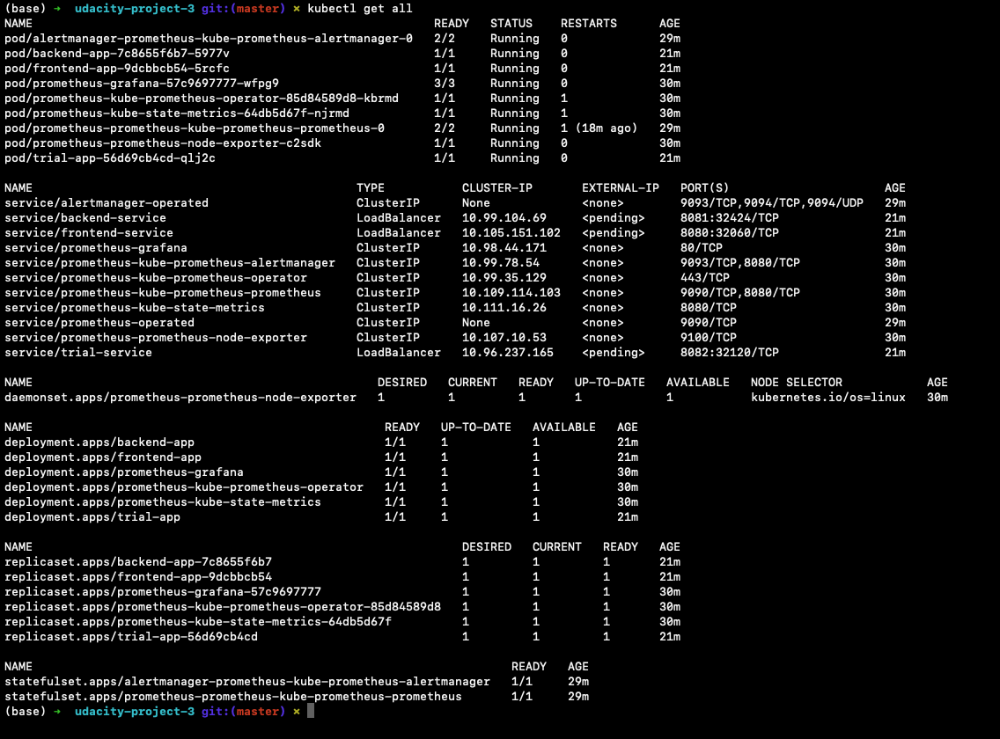
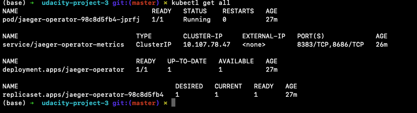
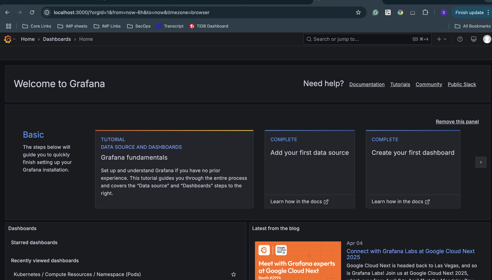
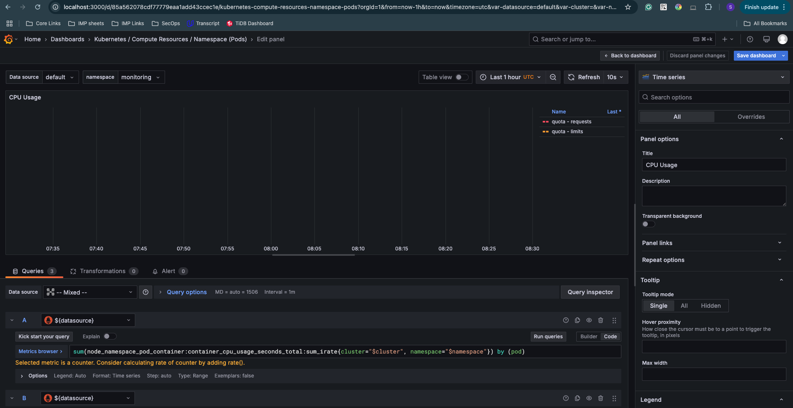
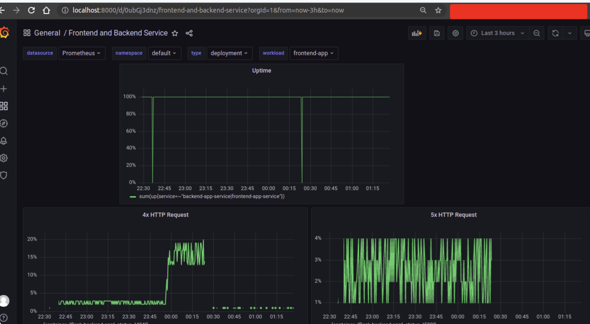

**Note:** For the screenshots, you can store all of your answer images in the `answer-img` directory.

## Verify the monitoring installation
[//]: # ()
*TODO:* run `kubectl` command to show the running pods and services for all components. Take a screenshot of the output and include it here to verify the installation

### Namespace: Monitoring

### Namespace: Observability

## Setup the Jaeger and Prometheus source
*TODO:* Expose Grafana to the internet and then setup Prometheus as a data source. Provide a screenshot of the home page after logging into Grafana.

## Create a Basic Dashboard
*TODO:* Create a dashboard in Grafana that shows Prometheus as a source. Take a screenshot and include it here.

## Describe SLO/SLI
*TODO:* Describe, in your own words, what the SLIs are, based on an SLO of *monthly uptime* and *request response time*.

#### SLI
An SLI is a service level indicator— a *quantitative* measure of some aspect of the level of service that is provided.
#### SLO
An SLO is a service level objective: a target value or range of values for a service level that is measured by an SLI. 
A natural structure for SLOs is thus SLI ≤ target, or lower bound ≤ SLI ≤ upper bound.

#### Example:
**monthly uptime** indicates that how much time a service or application available for the user. 
Here SLO will be our service or application will have the 99% uptime  during next month for the users.
But after next month we found that our service/application uptime was 98%. So our service/application
SLI is 98%. And here SLI< SLO(target)

**request response time** indicates that how much time need our service to execute a user request.
In this case our SLO will be 150 milliseconds  for a single user request and response time for our service. 
But in actual case we found that our service took 160 millisecond for a single request and response. So
160 milliseconds is our SLI.

## Creating SLI metrics.
*TODO:* It is important to know why we want to measure certain metrics for our customer. Describe in detail 5 metrics to measure these SLIs. 

There are several metrics for SLI. We need to choose this metrics for our application base:

  1. Request Latency - The time taken to serve a request (usually measured in ms).
  2. Error Rate - The percentage of requests that are failing (such as percentage of HTTP 500 responses).
  3. System Throughput - Typically measured in requests per second. 
  4. Uptime - The percentage of system availability during a defined period (such as 1 day or 1 month).
  5. Traffic - The amount of stress on a system from demand (such as the number of HTTP requests/second).

## Create a Dashboard to measure our SLIs
*TODO:* Create a dashboard to measure the uptime of the frontend and backend services We will also want to measure to measure 40x and 50x errors. Create a dashboard that show these values over a 24 hour period and take a screenshot.

Here we can easily select our existing namespace, and app.
So we can easily monitor backend and frontend service by selecting the service name and namespace.

